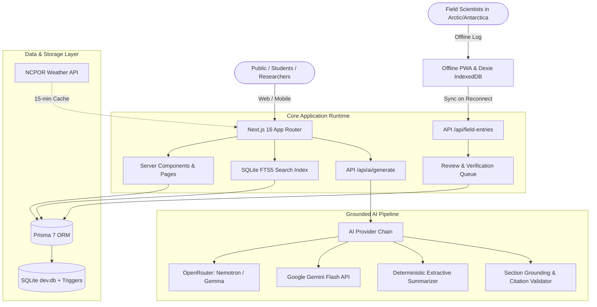

# Polar Stories · NCPOR Polar & Himalayan Science Outreach Portal

[-black?style=for-the-badge&logo=next.js)](https://nextjs.org/)
[](https://react.dev/)
[](https://www.typescriptlang.org/)
[](https://www.prisma.io/)
[](https://sqlite.org/)
[](https://tailwindcss.com/)
[](https://vitest.dev/)
[](https://playwright.dev/)
[](LICENSE)

> **Official National Centre for Polar and Ocean Research (NCPOR)** public outreach, knowledge repository, and interactive media dissemination portal. Built for **Smart India Hackathon (SIH 2026) — Problem Statement 26063**.

---

## 📌 Table of Contents

- [Overview & Vision](#-overview--vision)
- [Key Features](#-key-features)
- [System Architecture](#-system-architecture)
- [Interactive Polar Stations & Expeditions](#-interactive-polar-stations--expeditions)
- [Source Grounded Multilingual AI](#-source-grounded-multilingual-ai)
- [Offline-First Field Dispatch PWA](#-offline-first-field-dispatch-pwa)
- [Full-Text Search Engine](#-full-text-search-engine)
- [Tech Stack](#-tech-stack)
- [Getting Started](#-getting-started)
- [Environment Configuration](#-environment-configuration)
- [CLI Scripts & Automation](#-cli-scripts--automation)
- [Testing & Quality Assurance](#-testing--quality-assurance)
- [Public API Reference](#-public-api-reference)
- [Data Provenance & Policy](#-data-provenance--policy)
- [Author & Contributor](#-author--contributor)
- [License](#-license)

---

## 🌍 Overview & Vision

India's presence in the polar regions and high-altitude cryosphere spans over four decades across Antarctica, the Arctic, the Himalayas, and the Southern Ocean. However, scientific findings, expedition chronicles, daily meteorological records, and research bulletins are often fragmented across official gazettes, press releases, and technical archives.

**Polar Stories** bridges this outreach gap. Designed under **SIH 2026 Problem Statement 26063**, it delivers an integrated, intuitive, and rigorously verified knowledge dissemination portal for students, educators, research fellows, policymakers, and the general public.

### Core Tenets
1. **Zero Hallucination / Verbatim Grounding**: Every story chapter, educational explainer, and media asset is strictly tied to official Press Information Bureau (PIB) releases and NCPOR scientific expedition documentation.
2. **Inclusive Multilingual Outreach**: Plain-language science explanations accessible in English and Hindi (हिन्दी) for broad public engagement.
3. **Resilient Field Operations**: Remote offline-first Progressive Web App (PWA) allowing scientists stationed at zero-connectivity research outposts to log field data and photographs with automated background sync.
4. **Interactive Geospatial Storytelling**: Real-time maps, visual timelines, and chapter-by-chapter narratives embedded with official datasets from the National Polar Data Center (NPDC).

---

## ✨ Key Features

| Feature | Description |
|---|---|
| 🗺️ **Geospatial Station Explorer** | Interactive Leaflet-based map with custom Esri light-grey projections and linked timeline highlighting Maitri, Bharati, Himadri, and Himansh. |
| 📖 **Expedition Stories** | Immersive chapter-by-chapter narratives covering Indian scientific expeditions with verified paragraph-level citations. |
| 🤖 **Multilingual Grounded AI** | Generates simplified science summaries for students and the public in English and Hindi, strictly grounded in cited document sections. |
| 📡 **Offline Field PWA** | IndexedDB queue with client-side image compression (1600px + 240px thumbnails) and background sync when connection restores. |
| 🔍 **SQLite FTS5 Full-Text Search** | Blazing-fast BM25 full-text search with title matching priority, year/region filtering, and keyword snippet highlighting. |
| 🌡️ **Live NCPOR Telemetry** | Near real-time automated weather telemetry and temperature data fetched directly from NCPOR data portals. |
| 🖨️ **Printable Academic Handouts** | Optimized `@media print` stylesheets generating clean, single-column educational briefs with citations intact. |
| 🛡️ **Provenance & Review Desk** | Role-gated editorial dashboard to review, edit, and approve AI drafts and community field entries before publication. |
| 🖼️ **Dynamic OpenGraph Cards** | Server-side social share card generation displaying real titles, excerpts, and official source lines. |

---

## 🏛️ System Architecture

Polar Stories is built as a unified full-stack Next.js application (App Router) backed by SQLite through Prisma 7 with native SQL integrity triggers.



---

## 🏔️ Interactive Polar Stations & Expeditions

Explore India's key research outposts with live conditions, geographic locations, and historical timelines:

- **Maitri (Antarctica)**: Established 1989 in the Schirmacher Oasis ($70^\circ 45' 57'' \text{ S}, 11^\circ 44' 09'' \text{ E}$). India's second permanent Antarctic research station.
- **Bharati (Antarctica)**: Established 2012 in the Larsemann Hills ($69^\circ 24' 28'' \text{ S}, 76^\circ 11' 14'' \text{ E}$). Advanced, eco-friendly year-round research facility.
- **Himadri (Arctic)**: Established 2008 at Ny-Ålesund, Svalbard, Norway ($78^\circ 55' \text{ N}, 11^\circ 55' \text{ E}$). Dedicated Arctic atmospheric and marine research station.
- **Himansh (Himalaya)**: Established 2016 in the Spiti Valley, Himachal Pradesh at $4,080\text{ m}$ elevation. Specialized high-altitude glacier monitoring station.

---

## 🤖 Source Grounded Multilingual AI

The platform's AI engine synthesizes dense scientific papers and government bulletins into accessible public reading without hallucinations:

1. **Section-Level Grounding**: The LLM receives document text broken into indexed paragraphs. Every response must return the exact set of `usedSections`.
2. **Strict Verification**: The system checks returned section numbers against the database; outputs without valid citations are rejected automatically.
3. **Multilingual Support (EN / HI)**:
   - English: Plain-language explanations for general public and school students.
   - Hindi (हिन्दी): Devanagari plain-language summaries generated by hosted models.
4. **Deterministic Offline Fallback**: If internet connectivity is down or API keys are unset, a local deterministic summarizer operates directly on the text using domain glossaries.
5. **Human Editorial Loop**: AI outputs start in `pending` state; authorized reviewers can refine text while preserving citations before marking `approved`.

---

## 📡 Offline-First Field Dispatch PWA

Field personnel in high-latitude environments often operate with zero bandwidth:

- **IndexedDB Storage**: Field notes and photos save instantly on-device using Dexie.js.
- **On-Device Image Processing**: High-resolution photos are compressed to $1600\text{ px}$ with $240\text{ px}$ previews generated in-browser to save bandwidth.
- **Automated Queue Sync**: When internet returns, the background synchronizer dispatches entries with idempotency keys (UUIDs) to prevent duplicate submissions.
- **Service Worker Caching**: The `/field` application and static assets are cached offline via `public/sw.js`.

---

## 🔍 Full-Text Search Engine

Built on SQLite's native **FTS5** virtual table engine:
- **BM25 Relevance Tuning**: Title matches receive 10× weighting over body mentions.
- **Faceted Filtering**: Filter by geographic region (`antarctica`, `arctic`, `himalaya`) and expedition year.
- **Typo-Tolerant Prefix Matching**: Fast `term*` prefix queries ensure instant results.
- **Safe Highlighting**: Search snippets render safely using semantic `<mark>` elements.

---

## 💻 Tech Stack

- **Framework**: [Next.js 16.3.6](https://nextjs.org/) (App Router, Turbopack)
- **UI Library**: [React 19.3.0](https://react.dev/)
- **Language**: [TypeScript 5.9.3](https://www.typescriptlang.org/)
- **Database & ORM**: SQLite (`better-sqlite3`) + [Prisma 7.10.0](https://www.prisma.io/)
- **Styling**: [Tailwind CSS v4](https://tailwindcss.com/) with IBM Plex Sans & IBM Plex Serif
- **Maps**: [Leaflet](https://leafletjs.com/) with Esri Light Gray Canvas tiles
- **Client Storage**: [Dexie.js](https://dexie.org/) (IndexedDB wrapper)
- **AI Integrations**: OpenRouter API (`nvidia/nemotron-3-super-120b`, `gemma-4-31b-it:free`), Google Gemini API, Offline Extractive NLP
- **Testing**: [Vitest](https://vitest.dev/) (Unit tests) + [Playwright](https://playwright.dev/) (E2E production tests)

---

## 🚀 Getting Started

### Prerequisites
- **Node.js**: v20.x or higher (Node 24 recommended)
- **npm**: v10.x or higher

### Installation

1. **Clone the repository:**
   ```bash
   git clone https://github.com/SanjayGoffl/polar-science.git
   cd polar-science
   ```

2. **Install dependencies:**
   ```bash
   npm install
   ```

3. **Configure environment variables:**
   ```bash
   cp .env.example .env
   ```

4. **Initialize database & load official data:**
   ```bash
   npm run db:setup
   ```

5. **Start local development server:**
   ```bash
   npm run dev
   ```
   Open [http://localhost:3000](http://localhost:3000) in your browser.

---

## ⚙️ Environment Configuration

Create a `.env` file in the root directory:

```ini
# Database
DATABASE_URL="file:./dev.db"

# Admin Review Portal Authentication
ADMIN_PASSCODE="your_secure_admin_password"

# AI Provider Configuration (openrouter | gemini | offline)
AI_PROVIDER="openrouter"

# OpenRouter (Recommended for free tier models)
OPENROUTER_API_KEY=""
OPENROUTER_MODEL="nvidia/nemotron-3-super-120b-a12b:free"
OPENROUTER_FALLBACK_MODEL="openrouter/free"

# Google Gemini (Optional fallback)
GEMINI_API_KEY=""
GEMINI_MODEL="gemini-flash-latest"

# Next.js Metadata URL
NEXT_PUBLIC_SITE_URL="http://localhost:3000"
```

---

## 📜 CLI Scripts & Automation

| Command | Description |
|---|---|
| `npm run dev` | Starts Next.js development server with Turbopack |
| `npm run build` | Compiles production application bundle |
| `npm run start` | Runs production server (service worker active) |
| `npm run typecheck` | Validates TypeScript types across the project |
| `npm test` | Executes Vitest unit test suite (48 tests) |
| `npm run test:e2e` | Runs Playwright end-to-end test suite |
| `npm run test:e2e:prod` | Builds app and runs Playwright against production server |
| `npm run db:setup` | Deploys Prisma migrations and syncs source snapshots |
| `npm run db:migrate` | Runs database migrations in development |
| `npm run db:reset` | Resets SQLite database, clears uploads, and re-syncs |
| `npm run sources:fetch` | Re-fetches upstream official PIB and NCPOR snapshots |
| `npm run sources:sync` | Idempotently synchronizes snapshots into SQLite database |
| `npm run ai:check` | Verifies AI provider connectivity and responses |

---

## 🧪 Testing & Quality Assurance

The codebase maintains comprehensive test coverage across both unit and end-to-end integration tiers:

```bash
# Run unit tests
npm test

# Run TypeScript typecheck
npm run typecheck

# Run end-to-end Playwright tests
npm run test:e2e:prod
```

### Coverage Highlights:
- **Unit Testing (Vitest)**: Source hash caching, citation grounding verification, offline NLP extraction, prompt formatting, image upload magic-byte sniffing, and SQL database triggers.
- **E2E Testing (Playwright)**: Full user journeys, interactive Leaflet map panning, timeline navigation, offline field logging and IndexedDB persistence, multilingual AI generation, and admin review workflows.

---

## 🌐 Public API Reference

The portal provides read-only REST endpoints with public caching (`s-maxage=3600, stale-while-revalidate=86400`):

### 1. List Stations
```http
GET /api/v1/stations
```
**Query Parameters**: `region` (`antarctica` | `arctic` | `himalaya`)  
**Response**: Array of research stations with coordinates, descriptions, and official source links.

### 2. List Expeditions
```http
GET /api/v1/expeditions
```
**Query Parameters**: `region`, `year`, `limit`, `offset`  
**Response**: Paginated list of scientific expeditions, milestones, and reports.

### 3. Generate Grounded AI Explanation
```http
POST /api/ai/generate
Content-Type: application/json

{
  "reportId": "cmui...",
  "kind": "explanation",
  "audience": "student",
  "language": "en"
}
```

### 4. Sync Field Notes
```http
POST /api/field-entries
Content-Type: multipart/form-data
```
Handles offline queue submissions with idempotent UUIDs.

---

## 🏛️ Data Provenance & Policy

- **Government Open Data**: Official press releases and reports are curated from the [Press Information Bureau (PIB)](https://pib.gov.in/) and [National Centre for Polar and Ocean Research (NCPOR)](https://ncpor.res.in/).
- **Scientific Datasets**: Data portal references link directly to the [National Polar Data Center (NPDC)](https://npdc.ncpor.res.in/).
- **Media Attribution**: Photographs adhere to Government Open Data License - India (GODL-India), Creative Commons (CC BY-SA 4.0), or Public Domain terms.

---

## 👤 Author & Contributor

**Sanjay**  
- **GitHub**: [@SanjayGoffl](https://github.com/SanjayGoffl)  
- **Email**: jaagath1234@gmail.com  
- **Project**: [polar-science](https://github.com/SanjayGoffl/polar-science)

---

## 📄 License

This project is licensed under the [MIT License](LICENSE).
Official reports, press releases, and media remain the property of their respective copyright holders and government ministries.
